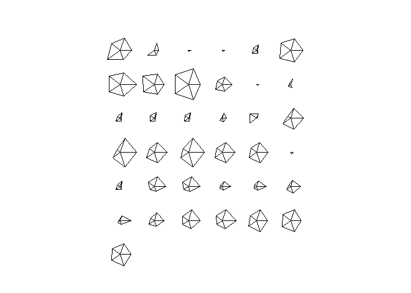
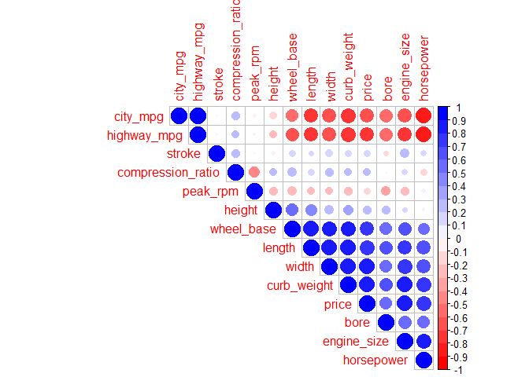
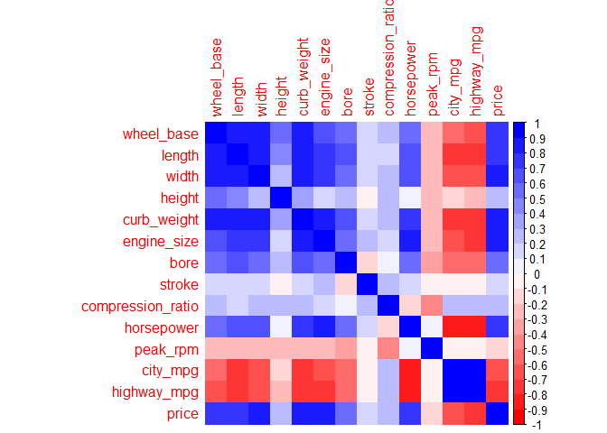
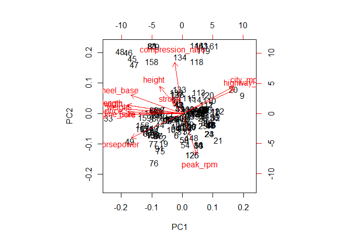

HW1
================
Hanmaro Song
February 19, 2018

Download the imports-85 data file

``` r
library(readr)

col_names = c('symboling', 'normalized_losses', 'make', 'fuel_type', 'aspiration', 'num_of_doors', 'body_style', 'drive_wheels', 'engine_location', 'wheel_base', 'length', 'width', 'height', 'curb_weight', 'engine_type', 'num_of_cylinders', 'engine_size', 'fuel_system', 'bore', 'stroke', 'compression_ratio', 'horsepower', 'peak_rpm', 'city_mpg', 'highway_mpg', 'price')

col_types = c(col_double(), 
              col_double(),
              col_character(),
              col_character(),
              col_character(),
              col_character(),
              col_character(),
              col_character(),
              col_character(),
              col_double(),
              col_double(),
              col_double(),
              col_double(),
              col_integer(),
              col_character(),
              col_character(),
              col_integer(),
              col_character(),
              col_double(),
              col_double(),
              col_integer(),
              col_integer(),
              col_integer(),
              col_integer(),
              col_integer(),
              col_integer()
)


data = read_csv('imports-85.data', col_names = col_names, col_types = col_types, na=c('?', 'NA'))
data2 = read.csv('imports-85.data', col.names = col_names, na.strings = "?")

class(data$symboling) = 'double'
class(data$normalized_losses) = 'double'
class(data2$symboling) = 'double'
class(data2$normalized_losses) = 'double'
class(data2$make) = 'character'
class(data2$fuel_type) = 'character'
class(data2$aspiration) = 'character'
class(data2$num_of_doors) = 'character'
class(data2$body_style) = 'character'
class(data2$drive_wheels) = 'character'
class(data2$engine_location) = 'character'
class(data2$wheel_base) = 'double'
class(data2$length) = 'double'
class(data2$width) = 'double'
class(data2$height) = 'double'
class(data2$curb_weight) = 'integer'
class(data2$engine_type) = 'character'
class(data2$num_of_cylinders) = 'character'
class(data2$engine_size) = 'integer'
class(data2$fuel_system) = 'character'
class(data2$bore) = 'double'
class(data2$stroke) = 'double'
class(data2$compression_ratio) = 'integer'
class(data2$horsepower) = 'integer'
class(data2$peak_rpm) = 'integer'
class(data2$city_mpg) = 'integer'
class(data2$highway_mpg) = 'integer'
class(data2$price) = 'integer'

str(data)
```

    ## Classes 'tbl_df', 'tbl' and 'data.frame':    205 obs. of  26 variables:
    ##  $ symboling        : num  3 3 1 2 2 2 1 1 1 0 ...
    ##  $ normalized_losses: num  NA NA NA 164 164 NA 158 NA 158 NA ...
    ##  $ make             : chr  "alfa-romero" "alfa-romero" "alfa-romero" "audi" ...
    ##  $ fuel_type        : chr  "gas" "gas" "gas" "gas" ...
    ##  $ aspiration       : chr  "std" "std" "std" "std" ...
    ##  $ num_of_doors     : chr  "two" "two" "two" "four" ...
    ##  $ body_style       : chr  "convertible" "convertible" "hatchback" "sedan" ...
    ##  $ drive_wheels     : chr  "rwd" "rwd" "rwd" "fwd" ...
    ##  $ engine_location  : chr  "front" "front" "front" "front" ...
    ##  $ wheel_base       : num  88.6 88.6 94.5 99.8 99.4 ...
    ##  $ length           : num  169 169 171 177 177 ...
    ##  $ width            : num  64.1 64.1 65.5 66.2 66.4 66.3 71.4 71.4 71.4 67.9 ...
    ##  $ height           : num  48.8 48.8 52.4 54.3 54.3 53.1 55.7 55.7 55.9 52 ...
    ##  $ curb_weight      : int  2548 2548 2823 2337 2824 2507 2844 2954 3086 3053 ...
    ##  $ engine_type      : chr  "dohc" "dohc" "ohcv" "ohc" ...
    ##  $ num_of_cylinders : chr  "four" "four" "six" "four" ...
    ##  $ engine_size      : int  130 130 152 109 136 136 136 136 131 131 ...
    ##  $ fuel_system      : chr  "mpfi" "mpfi" "mpfi" "mpfi" ...
    ##  $ bore             : num  3.47 3.47 2.68 3.19 3.19 3.19 3.19 3.19 3.13 3.13 ...
    ##  $ stroke           : num  2.68 2.68 3.47 3.4 3.4 3.4 3.4 3.4 3.4 3.4 ...
    ##  $ compression_ratio: num  9 9 9 10 8 8.5 8.5 8.5 8.3 7 ...
    ##  $ horsepower       : int  111 111 154 102 115 110 110 110 140 160 ...
    ##  $ peak_rpm         : int  5000 5000 5000 5500 5500 5500 5500 5500 5500 5500 ...
    ##  $ city_mpg         : int  21 21 19 24 18 19 19 19 17 16 ...
    ##  $ highway_mpg      : int  27 27 26 30 22 25 25 25 20 22 ...
    ##  $ price            : int  13495 16500 16500 13950 17450 15250 17710 18920 23875 NA ...
    ##  - attr(*, "spec")=List of 2
    ##   ..$ cols   :List of 26
    ##   .. ..$ symboling        : list()
    ##   .. .. ..- attr(*, "class")= chr  "collector_integer" "collector"
    ##   .. ..$ normalized_losses: list()
    ##   .. .. ..- attr(*, "class")= chr  "collector_integer" "collector"
    ##   .. ..$ make             : list()
    ##   .. .. ..- attr(*, "class")= chr  "collector_character" "collector"
    ##   .. ..$ fuel_type        : list()
    ##   .. .. ..- attr(*, "class")= chr  "collector_character" "collector"
    ##   .. ..$ aspiration       : list()
    ##   .. .. ..- attr(*, "class")= chr  "collector_character" "collector"
    ##   .. ..$ num_of_doors     : list()
    ##   .. .. ..- attr(*, "class")= chr  "collector_character" "collector"
    ##   .. ..$ body_style       : list()
    ##   .. .. ..- attr(*, "class")= chr  "collector_character" "collector"
    ##   .. ..$ drive_wheels     : list()
    ##   .. .. ..- attr(*, "class")= chr  "collector_character" "collector"
    ##   .. ..$ engine_location  : list()
    ##   .. .. ..- attr(*, "class")= chr  "collector_character" "collector"
    ##   .. ..$ wheel_base       : list()
    ##   .. .. ..- attr(*, "class")= chr  "collector_double" "collector"
    ##   .. ..$ length           : list()
    ##   .. .. ..- attr(*, "class")= chr  "collector_double" "collector"
    ##   .. ..$ width            : list()
    ##   .. .. ..- attr(*, "class")= chr  "collector_double" "collector"
    ##   .. ..$ height           : list()
    ##   .. .. ..- attr(*, "class")= chr  "collector_double" "collector"
    ##   .. ..$ curb_weight      : list()
    ##   .. .. ..- attr(*, "class")= chr  "collector_integer" "collector"
    ##   .. ..$ engine_type      : list()
    ##   .. .. ..- attr(*, "class")= chr  "collector_character" "collector"
    ##   .. ..$ num_of_cylinders : list()
    ##   .. .. ..- attr(*, "class")= chr  "collector_character" "collector"
    ##   .. ..$ engine_size      : list()
    ##   .. .. ..- attr(*, "class")= chr  "collector_integer" "collector"
    ##   .. ..$ fuel_system      : list()
    ##   .. .. ..- attr(*, "class")= chr  "collector_character" "collector"
    ##   .. ..$ bore             : list()
    ##   .. .. ..- attr(*, "class")= chr  "collector_double" "collector"
    ##   .. ..$ stroke           : list()
    ##   .. .. ..- attr(*, "class")= chr  "collector_double" "collector"
    ##   .. ..$ compression_ratio: list()
    ##   .. .. ..- attr(*, "class")= chr  "collector_double" "collector"
    ##   .. ..$ horsepower       : list()
    ##   .. .. ..- attr(*, "class")= chr  "collector_integer" "collector"
    ##   .. ..$ peak_rpm         : list()
    ##   .. .. ..- attr(*, "class")= chr  "collector_integer" "collector"
    ##   .. ..$ city_mpg         : list()
    ##   .. .. ..- attr(*, "class")= chr  "collector_integer" "collector"
    ##   .. ..$ highway_mpg      : list()
    ##   .. .. ..- attr(*, "class")= chr  "collector_integer" "collector"
    ##   .. ..$ price            : list()
    ##   .. .. ..- attr(*, "class")= chr  "collector_integer" "collector"
    ##   ..$ default: list()
    ##   .. ..- attr(*, "class")= chr  "collector_guess" "collector"
    ##   ..- attr(*, "class")= chr "col_spec"

``` r
str(data2)
```

    ## 'data.frame':    204 obs. of  26 variables:
    ##  $ symboling        : num  3 1 2 2 2 1 1 1 0 2 ...
    ##  $ normalized_losses: num  NA NA 164 164 NA 158 NA 158 NA 192 ...
    ##  $ make             : atomic  1 1 2 2 ...
    ##   ..- attr(*, "levels")= chr  "alfa-romero" "audi" "bmw" "chevrolet" ...
    ##  $ fuel_type        : atomic  2 2 2 2 ...
    ##   ..- attr(*, "levels")= chr  "diesel" "gas"
    ##  $ aspiration       : atomic  1 1 1 1 ...
    ##   ..- attr(*, "levels")= chr  "std" "turbo"
    ##  $ num_of_doors     : atomic  2 2 1 1 ...
    ##   ..- attr(*, "levels")= chr  "four" "two"
    ##  $ body_style       : atomic  1 3 4 4 ...
    ##   ..- attr(*, "levels")= chr  "convertible" "hardtop" "hatchback" "sedan" ...
    ##  $ drive_wheels     : atomic  3 3 2 1 ...
    ##   ..- attr(*, "levels")= chr  "4wd" "fwd" "rwd"
    ##  $ engine_location  : atomic  1 1 1 1 ...
    ##   ..- attr(*, "levels")= chr  "front" "rear"
    ##  $ wheel_base       : num  88.6 94.5 99.8 99.4 99.8 ...
    ##  $ length           : num  169 171 177 177 177 ...
    ##  $ width            : num  64.1 65.5 66.2 66.4 66.3 71.4 71.4 71.4 67.9 64.8 ...
    ##  $ height           : num  48.8 52.4 54.3 54.3 53.1 55.7 55.7 55.9 52 54.3 ...
    ##  $ curb_weight      : int  2548 2823 2337 2824 2507 2844 2954 3086 3053 2395 ...
    ##  $ engine_type      : atomic  1 6 4 4 ...
    ##   ..- attr(*, "levels")= chr  "dohc" "dohcv" "l" "ohc" ...
    ##  $ num_of_cylinders : atomic  3 4 3 2 ...
    ##   ..- attr(*, "levels")= chr  "eight" "five" "four" "six" ...
    ##  $ engine_size      : int  130 152 109 136 136 136 136 131 131 108 ...
    ##  $ fuel_system      : atomic  6 6 6 6 ...
    ##   ..- attr(*, "levels")= chr  "1bbl" "2bbl" "4bbl" "idi" ...
    ##  $ bore             : num  3.47 2.68 3.19 3.19 3.19 3.19 3.19 3.13 3.13 3.5 ...
    ##  $ stroke           : num  2.68 3.47 3.4 3.4 3.4 3.4 3.4 3.4 3.4 2.8 ...
    ##  $ compression_ratio: int  9 9 10 8 8 8 8 8 7 8 ...
    ##  $ horsepower       : int  111 154 102 115 110 110 110 140 160 101 ...
    ##  $ peak_rpm         : int  5000 5000 5500 5500 5500 5500 5500 5500 5500 5800 ...
    ##  $ city_mpg         : int  21 19 24 18 19 19 19 17 16 23 ...
    ##  $ highway_mpg      : int  27 26 30 22 25 25 25 20 22 29 ...
    ##  $ price            : int  16500 16500 13950 17450 15250 17710 18920 23875 NA 16430 ...

Question 3

1.  If the col.names are not given when reading it, it will be set as the value of each column in the first line.

2.  If the header is set to false, it will have col.names of v1, v2, v3, ... vn where n is last number of column.

3.  Its type will be set as factors even if other values are integer or character.

4.  The bytes should actually decrease when we specify types of columns in given data set because some characters have less bytes than the other. For example, the character only takes up 1 byte while integer takes 4 while double takes up 32(or 64) bytes. If there are more types with bigger bytes than the number of factors, then it would get bigger or else at most equal or less than it. The size depending on actual types of each columns will vary.

5.  When dataframe is converted into matrix, its column names and row names(if any) will be removed. Not only that, the matrix can only have arrays with same data type while dataframe can have columns with different data type. Both are still 2 dimensional arrays.

Question 4

``` r
hist(data$price, col = c("red", "blue", 'green', 'yellow', 'black', 'brown', 'orange', 'pink', 'violet'))
```


``` r
boxplot(data$horsepower, horizontal = TRUE)
```


``` r
barplot(sort(table(data$body_style), decreasing = TRUE ))
```


``` r
stars(data[data['aspiration'] == 'turbo', c('height', 'length', 'price', 'width', 'wheel_base')])
```



Question 5

``` r
gas_type = data[data['fuel_type'] == 'gas', ]
mean(gas_type$price, na.rm=TRUE)
```

    ## [1] 12916.41

``` r
diesel_type = data[data['fuel_type'] == 'diesel', ]
mean(diesel_type$price, na.rm=TRUE)
```

    ## [1] 15838.15

``` r
data[data['num_of_cylinders'] == 'twelve', 'make']
```

    ## # A tibble: 1 x 1
    ##   make  
    ##   <chr> 
    ## 1 jaguar

``` r
tbl = table(data[data['fuel_type'] == 'diesel', 'make'])
names(tbl[tbl == max(tbl)])
```

    ## [1] "peugot"

``` r
price_list = data[!is.na(data['price']), ]
price = data.frame(price_list[price_list['horsepower'] == max(price_list['horsepower'], na.rm=TRUE), 'price'])
price[!is.na(price)]
```

    ## [1] 36000

``` r
strongest_horsepower_make = data[data['horsepower'] == max(data['horsepower'], na.rm=TRUE), 'make']
strongest_horsepower_make[!is.na(strongest_horsepower_make),]
```

    ## # A tibble: 1 x 1
    ##   make   
    ##   <chr>  
    ## 1 porsche

``` r
bottom = quantile(data$city_mpg, .1)

bottom
```

    ## 10% 
    ##  17

``` r
top = quantile(data$highway_mpg, .9)
top
```

    ## 90% 
    ##  38

``` r
median(data[data['city_mpg'] == bottom,]$price, na.rm=TRUE)
```

    ## [1] 18685

Question 6

1.  It gives an error: Unknown or uninitialised column: 'xyz'.NULL

2.  1.  It returns a vector

<!-- -->

1.  It returns a list

2.  It returns a vector

3.  It returns an error

4.  It returns a vector

5.  It returns a vector

6.  It returns a list

<!-- -->

1.  1.  returns a subset of dataframe which results in returning another dataframe or a list

<!-- -->

1.  returns an error because there is no object variable named mpg in mtcars. If one wanted to use mpg, one should enclose it in quotes which exist in mtcars as a column name.

2.  This is similar to 2) that it returns a subset of mtcars.

<!-- -->

1.  No, because while a list can contain multiple types of variable while a vector within a dataframe should be having one specific type of variables.

2.  It returns a list of lists that each list contains elements of each columns values. It converts each column into a list.

3.  Simply use data.frame(mtcars)

Question 7

``` r
library(corrplot)
```

    ## corrplot 0.84 loaded

``` r
M = na.omit(data)
M = c(M[10:14], M[17], M[19:26])
qdat = data.frame(M)

# There are some features completely inversely proportional while many are proportional.
# For example, as the price goes up, the city_mpg and highway_mpg gets decreases.
# Also as those two mpg values decrease, wheel_base, length, width, curb_weight, engine_size increase while 
# it almost doesn't affect the height of a car. 
# Stroke almost is not correlated to any other features of a car as well. 
# Peak_rpm doesn't do anything with horsepower, stroke, and mpg values but its value is slightly inversely propotional to other features that are inversely proportional to mpgs. 
# Two top features that don't get affected by other features are stroke and compression_ratio while height is the third feature.
```

``` r
col = colorRampPalette(c('red', 'white', 'blue'))(20)
corrplot(cor(qdat), method='circle', type='upper', order='hclust', col=col)
```



``` r
corrplot(cor(qdat), method='color', sig.level = 0.03, insig = 'blank', col=col)
```

 Question 8

``` r
pca = prcomp(qdat, scale. = TRUE)

summary(pca)
```

    ## Importance of components:
    ##                           PC1    PC2     PC3     PC4     PC5     PC6
    ## Standard deviation     2.7893 1.4304 1.14811 0.94193 0.75197 0.62526
    ## Proportion of Variance 0.5557 0.1462 0.09415 0.06337 0.04039 0.02793
    ## Cumulative Proportion  0.5557 0.7019 0.79604 0.85942 0.89981 0.92773
    ##                            PC7     PC8     PC9    PC10    PC11    PC12
    ## Standard deviation     0.52553 0.47080 0.38450 0.34949 0.29904 0.29346
    ## Proportion of Variance 0.01973 0.01583 0.01056 0.00872 0.00639 0.00615
    ## Cumulative Proportion  0.94746 0.96329 0.97385 0.98258 0.98896 0.99512
    ##                           PC13    PC14
    ## Standard deviation     0.21401 0.15024
    ## Proportion of Variance 0.00327 0.00161
    ## Cumulative Proportion  0.99839 1.00000

``` r
#Proportion of Variance
#PC1 = 0.5557
#PC2 = 0.1462
#PC3 = 0.09415
```

``` r
# scatter plot
plot(pca$x)
```


``` r
group = factor(rownames(pca$rotation))
plot(pca$rotation, col = group)
legend(0,0,group, col=group, pch=1)
```


``` r
biplot(pca)
```


