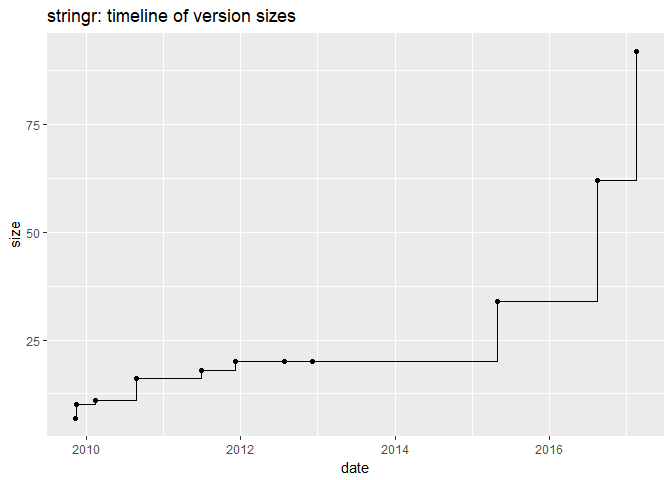
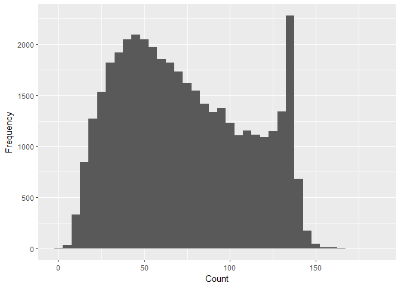
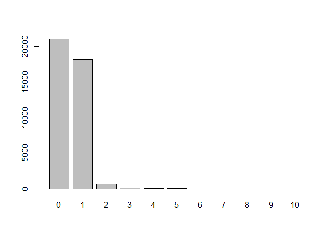
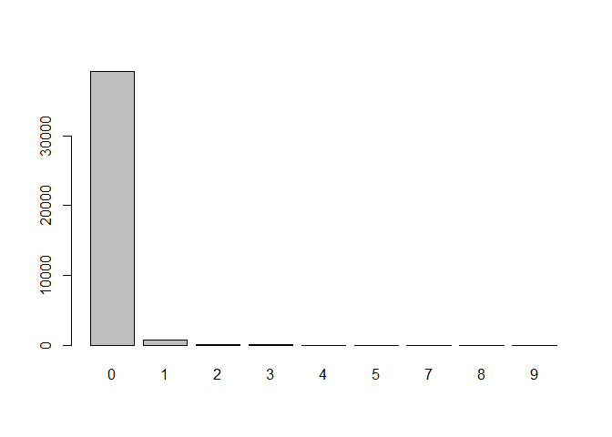

hw04
================
Hanmaro Song
April 2, 2018

``` r
source('../code/archive-functions.R')
source('../code/regex-functions.R')

raw_stringr = read_archive('stringr')
raw_dplyr = read_archive('dplyr')
raw_ggplot2 = read_archive('ggplot2')
raw_XML = read_archive('XML')
raw_knitr = read_archive('knitr')

clean_stringr = clean_archive(raw_stringr)
clean_dplyr = clean_archive(raw_dplyr)
clean_ggplot2 = clean_archive(raw_ggplot2)
clean_XML = clean_archive(raw_XML)
clean_knitr = clean_archive(raw_knitr)

write.csv(clean_stringr, '../data/stringr.csv')
write.csv(clean_dplyr, '../data/dplyr.csv')
write.csv(clean_ggplot2, '../data/ggplot2.csv')
write.csv(clean_XML, '../data/XML.csv')
write.csv(clean_knitr, '../data/knitr.csv')


dat = rbind(clean_dplyr, clean_ggplot2, clean_XML, clean_knitr)

plot_archive(clean_stringr)
```



``` r
plt = ggplot(dat, aes(x = date, y = size, group = name, colour = name)) +
  geom_step() +
  ylab('Size (Kilobytes)')

plt
```


``` r
plt + facet_wrap( ~ name, scale = 'free')
```


``` r
emotion = read.csv('../data/text-emotion.csv')


# 3.1
emotion['length'] = str_count(emotion$content)
ggplot(emotion, aes(emotion$length)) + geom_histogram(binwidth = 5) + xlab("Count") + ylab("Frequency")
```



``` r
# '@[^!@#$%^&*()<>?;:"\\s]{1, 15}\\s?'
# 3.2
at = unlist(lapply(str_extract_all(emotion$content, pattern = '@[^!@#$%^&*()<>?;:"~`\\s]{1,15}\\s?'), function(x) length(x)))
emotion['at count'] = at
total_mentions = sum(emotion$`at count`)
total_mentions
```

    ## [1] 20011

``` r
frequency_plot = barplot(table(at))
```



``` r
table(at)
```

    ## at
    ##     0     1     2     3     4     5     6     7     8     9    10 
    ## 21040 18164   649    87    34    16     5     1     2     1     1

``` r
frequency_plot
```

    ##       [,1]
    ##  [1,]  0.7
    ##  [2,]  1.9
    ##  [3,]  3.1
    ##  [4,]  4.3
    ##  [5,]  5.5
    ##  [6,]  6.7
    ##  [7,]  7.9
    ##  [8,]  9.1
    ##  [9,] 10.3
    ## [10,] 11.5
    ## [11,] 12.7

``` r
most_mention_content = emotion[emotion['at count'] == 10, 'content']
summary(emotion$`at count`)
```

    ##    Min. 1st Qu.  Median    Mean 3rd Qu.    Max. 
    ##  0.0000  0.0000  0.0000  0.5003  1.0000 10.0000

``` r
# 3.3
hash = unlist(lapply(str_extract_all(emotion$content, pattern = '#[a-zA-Z]*[0-9a-zA-Z]*'), function(x) length(x)))
emotion['hash count'] = hash
total_hash = unlist(lapply(str_extract_all(emotion$content, pattern = '#[a-zA-Z]*[0-9a-zA-Z]*'), function(x) nchar(x) - 1))

barplot(table(hash))
```



``` r
average_hash = mean(total_hash)

uniqv <- unique(total_hash)
uniqv[which.max(tabulate(match(total_hash, uniqv)))]
```

    ## [1] 9
