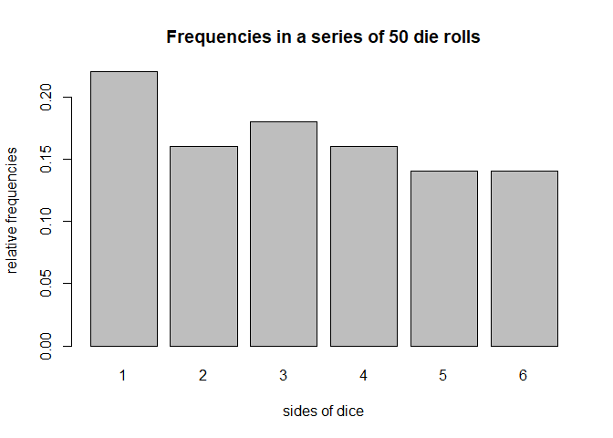

Report for HW5
================
Hanmaro Song
April 25, 2018

Installation
------------

devtools::install\_github("stat133-sp18/hw-stat133-hsong1101")

Load library
------------

``` r
library(dieroller)
```

Usage
-----

``` r
set.seed(123)
d = die(sides = c('i', 'ii', 'iii', 'iv', 'v', 'vi'), prob = c(0.2, 0.2, 0.3, 0.1, 0.1, 0.1))
r = roll(d, times = 10)
r
```

    ## object "roll"
    ## 
    ## $rolls
    ##  [1] "iii" "vi"  "i"   "v"   "iv"  "iii" "ii"  "v"   "ii"  "i"

``` r
summary(r)
```

    ## summary "roll"
    ## 
    ##   side count prop
    ## 1    i     2  0.2
    ## 2   ii     2  0.2
    ## 3  iii     2  0.2
    ## 4   iv     1  0.1
    ## 5    v     2  0.2
    ## 6   vi     1  0.1

``` r
plot(r)
```


``` r
s = summary(r)
s
```

    ## summary "roll"
    ## 
    ##   side count prop
    ## 1    i     2  0.2
    ## 2   ii     2  0.2
    ## 3  iii     2  0.2
    ## 4   iv     1  0.1
    ## 5    v     2  0.2
    ## 6   vi     1  0.1

``` r
s$freqs
```

    ##   side count prop
    ## 1    i     2  0.2
    ## 2   ii     2  0.2
    ## 3  iii     2  0.2
    ## 4   iv     1  0.1
    ## 5    v     2  0.2
    ## 6   vi     1  0.1

``` r
s$freqs$count[6]
```

    ## [1] 1

``` r
set.seed(123)
fair_die = die()
fair_50rolls = roll(fair_die, times = 50)
fair_sum = summary(fair_50rolls)
fair_sum
```

    ## summary "roll"
    ## 
    ##   side count prop
    ## 1    1    11 0.22
    ## 2    2     8 0.16
    ## 3    3     9 0.18
    ## 4    4     8 0.16
    ## 5    5     7 0.14
    ## 6    6     7 0.14

``` r
plot(fair_50rolls)
```



``` r
set.seed(123)
fair500 = roll(fair_die, times = 500)
summary(fair500)
```

    ## summary "roll"
    ## 
    ##   side count  prop
    ## 1    1    80 0.160
    ## 2    2    81 0.162
    ## 3    3    92 0.184
    ## 4    4    92 0.184
    ## 5    5    72 0.144
    ## 6    6    83 0.166

``` r
fair500[500]
```

    ## [1] 6

``` r
fair500[500] = 1
fair500[500]
```

    ## [1] 1

``` r
summary(fair500)
```

    ## summary "roll"
    ## 
    ##   side count  prop
    ## 1    1    81 0.162
    ## 2    2    81 0.162
    ## 3    3    92 0.184
    ## 4    4    92 0.184
    ## 5    5    72 0.144
    ## 6    6    82 0.164

``` r
fair600 = fair500 + 100
summary(fair600)
```

    ## summary "roll"
    ## 
    ##   side count      prop
    ## 1    1   100 0.1666667
    ## 2    2    97 0.1616667
    ## 3    3   104 0.1733333
    ## 4    4   109 0.1816667
    ## 5    5    91 0.1516667
    ## 6    6    99 0.1650000

``` r
plot(fair500, 500)
```


De Mere's Problem
-----------------

``` r
# Problem 1

total_games = 1000

die1 = die()
freq = 0
set.seed(123)
for (i in 1:total_games) {
  r = roll(die1, times = 4)
  s = summary(r)
  if (6 %in% r$rolls) {
    freq = freq + 1
  }
}
freq = freq / total_games

# The probability of getting at least '6' in four rolls of a die
freq
```

    ## [1] 0.527

``` r
# The probability of getting at least '6' in four rolls of a die
1 - (5/6)^4
```

    ## [1] 0.5177469

``` r
# Problem 2

freq = 0
set.seed(123)
for (i in 1:total_games) {
  
  r1 = roll(die1, times = 24)
  r2 = roll(die1, times = 24)
  
  count = 0
  
  for (i in 1:24) {
    if (r1[i] == 6 & r2[i] == 6) {
      count = count + 1
    }
    if (count > 0) {
      freq = freq + 1
      break
    }
  }
  
  
  
  }
freq = freq / total_games

# The probability of getting at least two '6' in 24 rolls of a pair of a die
freq
```

    ## [1] 0.477

``` r
# The probability of getting at least two '6' in 24 rolls of a pair of a die
1 - (35/36)^24
```

    ## [1] 0.4914039
